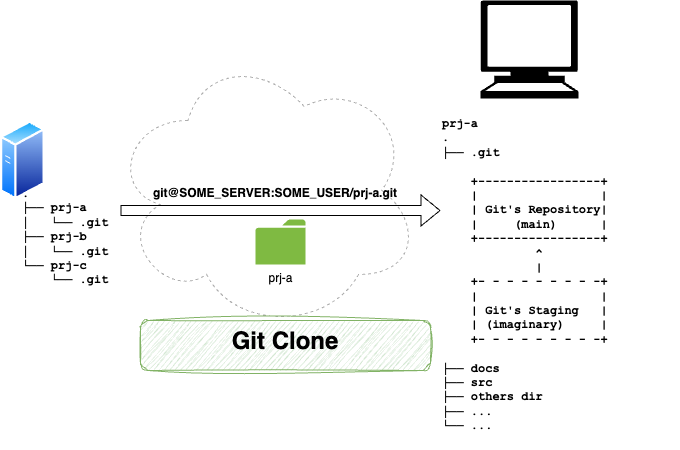
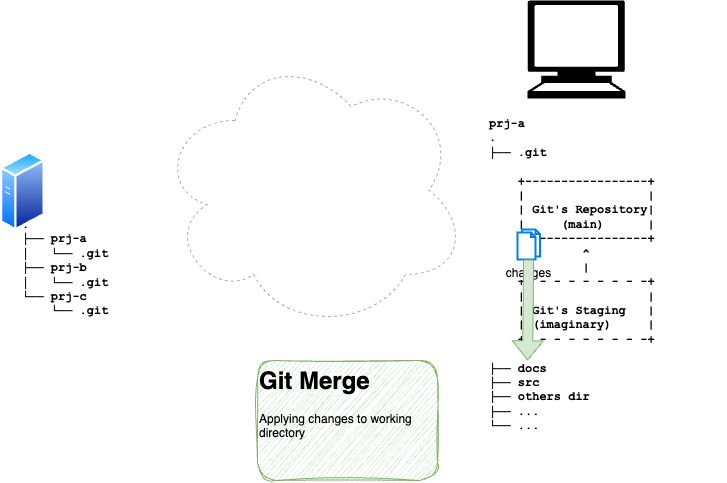
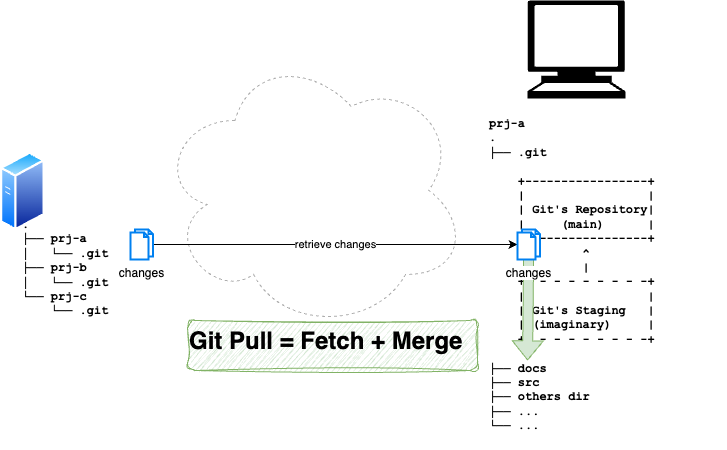
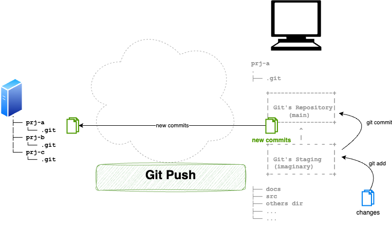
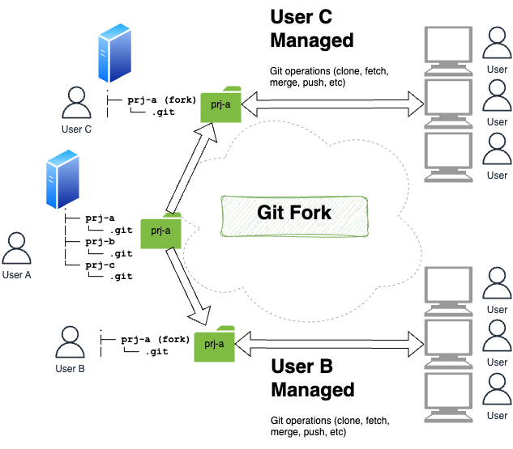
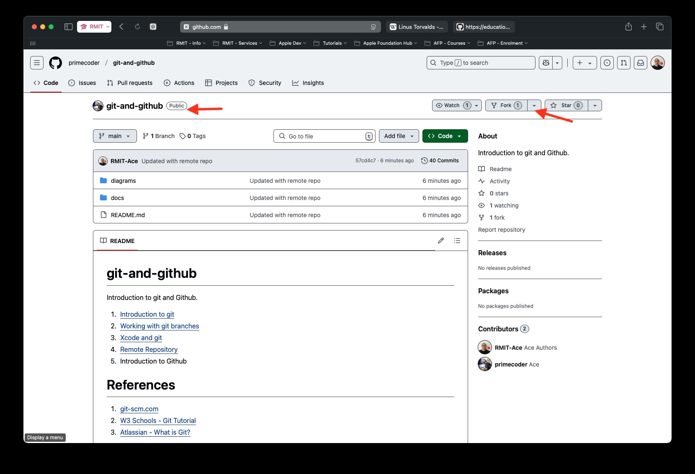
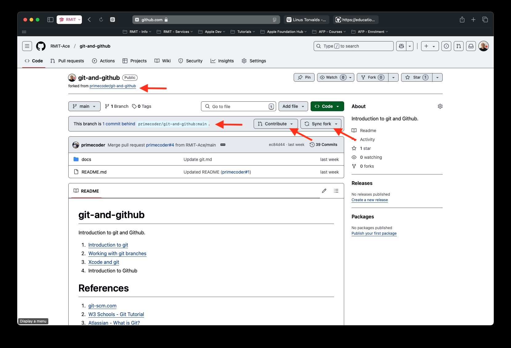

# Remote Repository

- git clone
- git fetch
- git merge
- git pull
- git push
- git fork

## Git Clone

A copy of the selected repository (prj-a) is downloaded from the remote server to your local computer. Once cloned, your local copy contains the full project folder structure (such as docs, src, and other directories), along with a .git folder that stores the repository history and a local main branch - giving you everything you need to start working on the project.

## Git Fetch

The diagram shows what git fetch does. Unlike git clone, which downloads an entire repository for the first time, git fetch retrieves only the changes that have been made on the remote server since your last sync. Importantly, those changes are brought into your local Git repository but are not merged into your working files - your actual project files remain untouched until you decide to apply the changes. This makes git fetch a safe way to check what's new on the remote without affecting your current work.

## Git Merge

After a git fetch has retrieved changes into your local repository, git merge takes those changes and applies them to your actual working directory - your project files such as docs, src, and other folders are updated to reflect the latest version. This is the step where the fetched changes become real and visible in your project.

## Git Pull

The diagram shows that git pull is simply a combination of git fetch and git merge in a single command. It retrieves the latest changes from the remote server and immediately applies them to your local working directory in one step - saving you from having to run both commands separately.

## Git Push

The diagram shows what git push does - the opposite direction of git pull. First, you use git add to move your local changes into the staging area, then git commit to save them into your local repository. Finally, git push sends those new commits from your local repository up to the remote server, making your changes available to everyone else on the project.

# Git Fork (Github?)

The diagram shows what git fork does. Rather than cloning a repository directly to your local machine, forking creates your own independent copy of the repository on the remote server. In the diagram, User A owns the original prj-a repository. Both User B and User C each fork it, getting their own separate copies on the server. Each user then manages their own fork independently - cloning, fetching, pushing, and merging as needed - without directly affecting the original. Forking is commonly used when you want to contribute to someone else's project or experiment freely without touching the original codebase.

## Git Fork - Source

This shows a public GitHub repository that is available to fork. Navigate to the repository you want to fork on GitHub. You can see the Fork button in the top-right corner of the page - the number next to it shows how many times the repository has already been forked. Click the Fork button to create your own copy of this repository under your GitHub account.

## Git Fork - Destination (copied)

After forking, you are taken to your own copy of the repository under your GitHub account. Notice the header now shows your username as the owner, with a "forked from" link back to the original repository beneath it. GitHub also indicates if your fork is behind the original — use the Sync fork button to pull in any new changes from the original, or the Contribute button to send your changes back to the original via a pull request.