# XCode and git

Let's start with a project with this directory structure below.
The present of `.git` (hidden) folder implies that this directory and all its sub directories are under a git repository.

```
.
├── .git            <- This is a git repo.
├── docs
└── src
    ├── file0.txt
    ├── file1.txt
    ├── file2.txt
    └── file3.txt
```

Create new Xcode project.

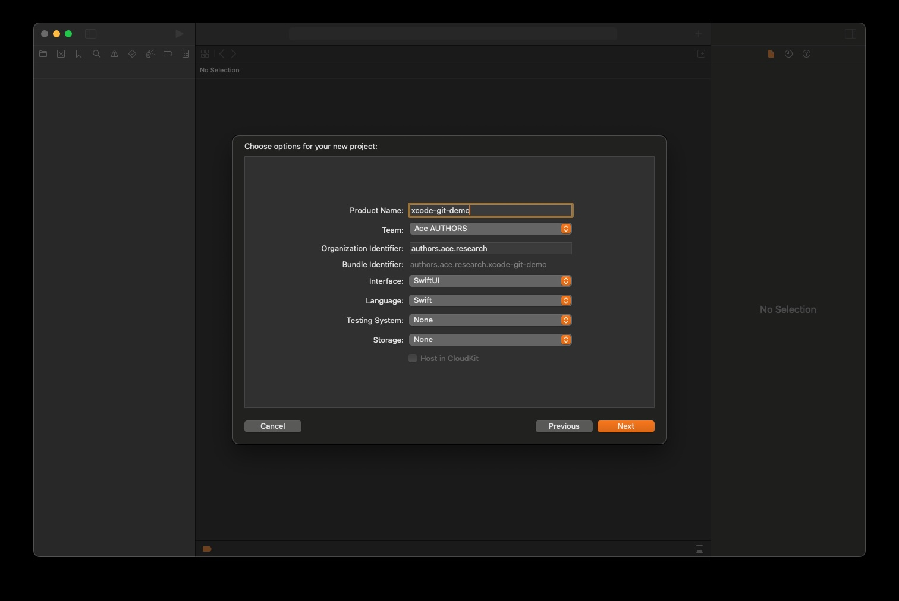


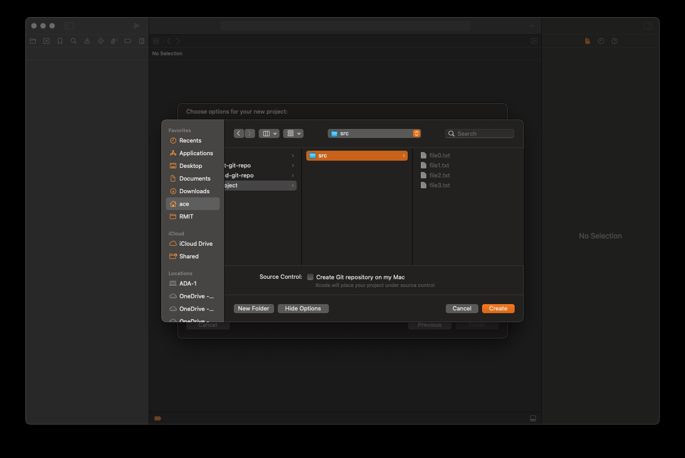

Checking directory structure.

```
└── src
    ├── file0.txt
    ├── file1.txt
    ├── file2.txt
    ├── file3.txt
    └── xcode-git-demo                \
        ├── xcode-git-demo            | Xcode's project folder
        └── xcode-git-demo.xcodeproj  /
```

Xcode allows a NEW git repository to be created upon creating a new project.
However, if this new Xcode project is to be a part of an existing git repository, this step should be skipped - it is not recommended nesting .git repository.

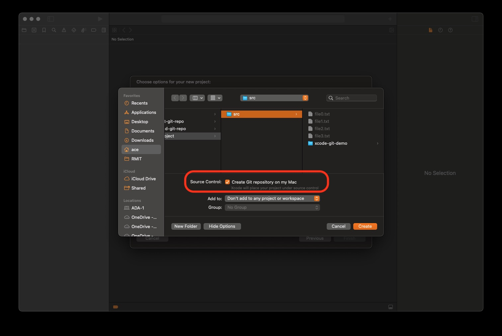

```
└── src
    ├── file0.txt
    ├── file1.txt
    ├── file2.txt
    ├── file3.txt
    ├── xcode-git-demo
    │   ├── xcode-git-demo
    │   └── xcode-git-demo.xcodeproj
    └── xcode-git-demo2
        ├── .git                      <<- Nested .git - not recommended
        ├── xcode-git-demo2
        └── xcode-git-demo2.xcodeproj
```

To keep our tutorial tidy, we will remove this Xcode project `xode-git-demo2`.

Let checks Xcode's features that support git operations.

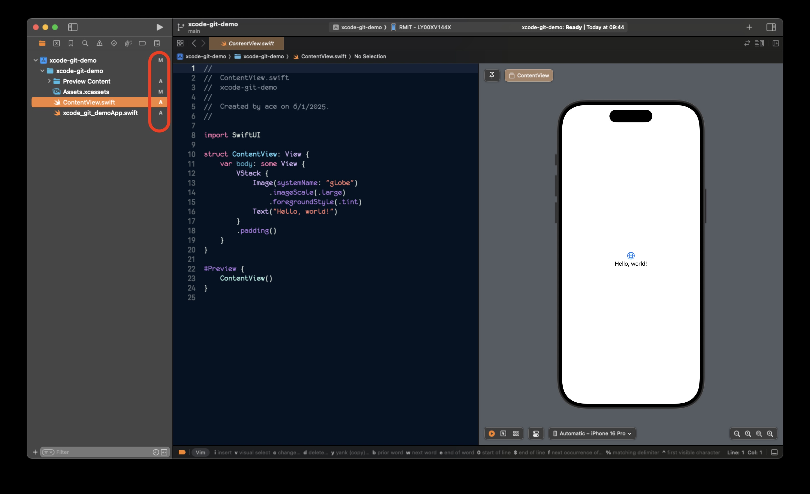

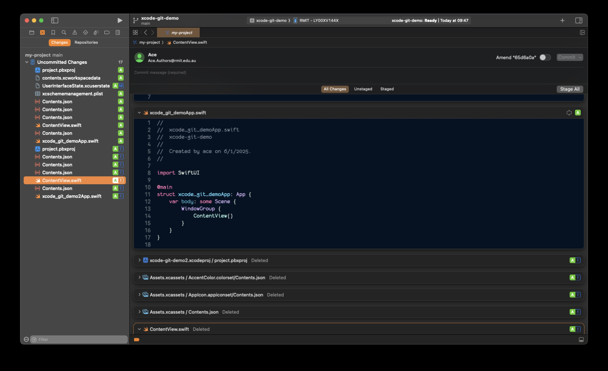

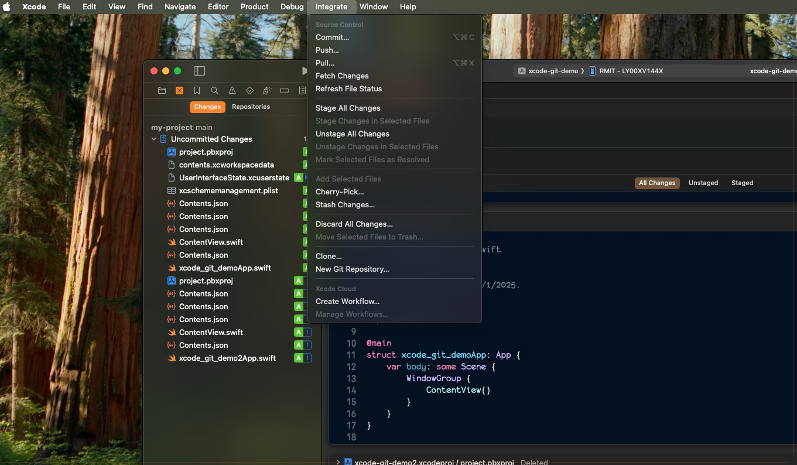

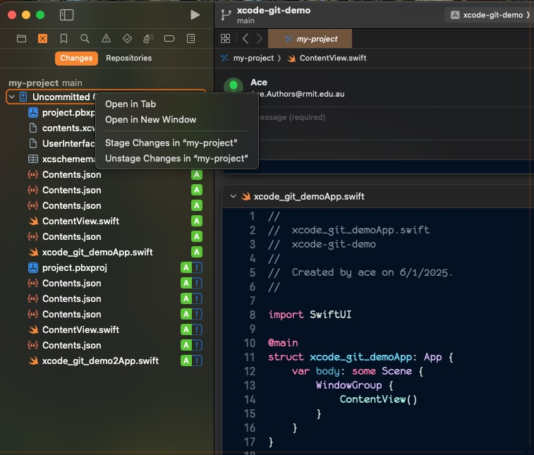

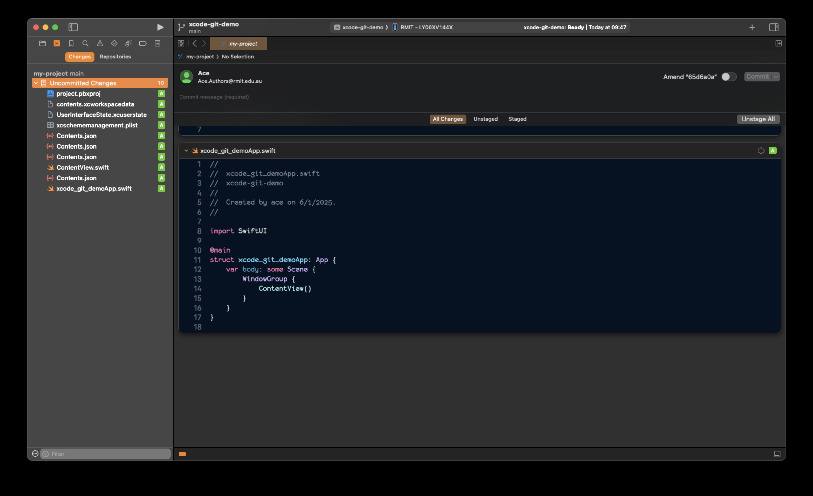

Committing changes requires brief description.

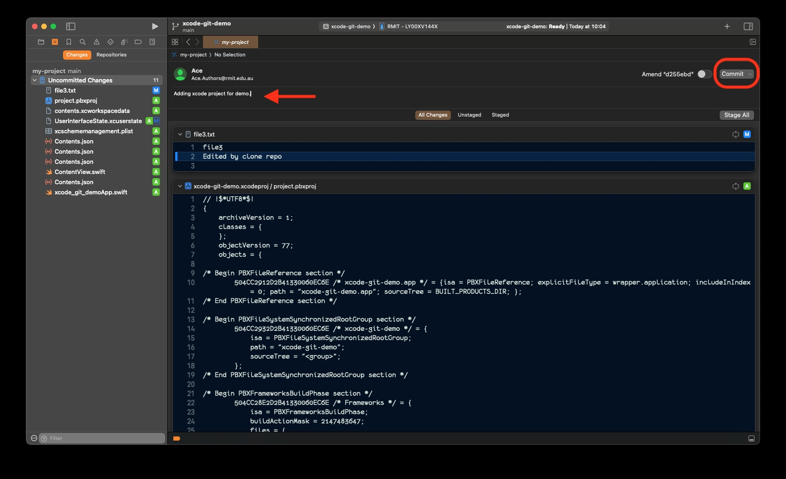

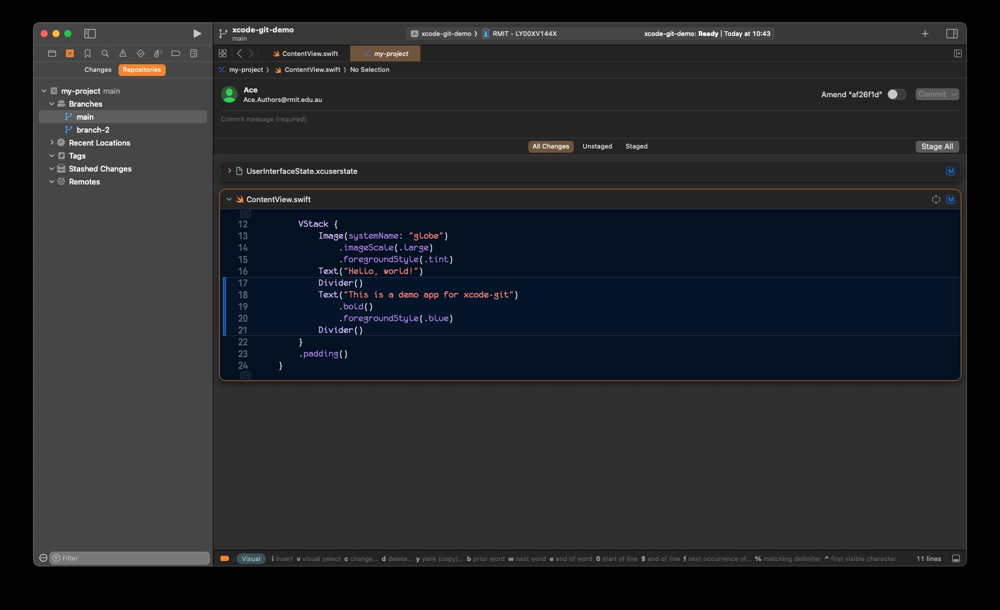

See who made what changes and when, etc.

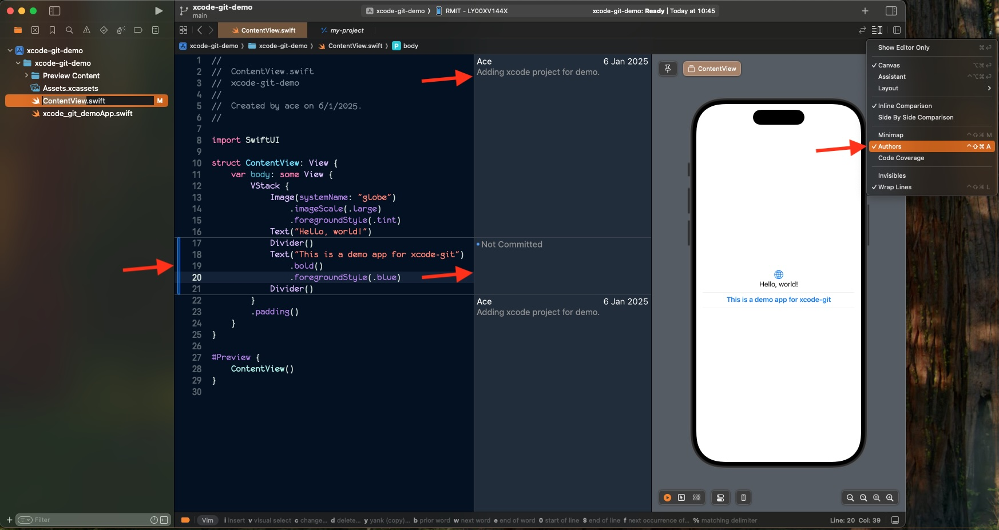

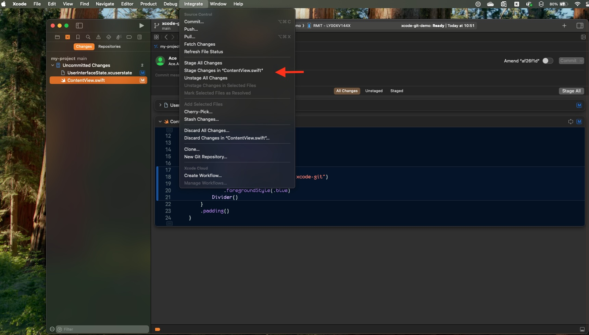

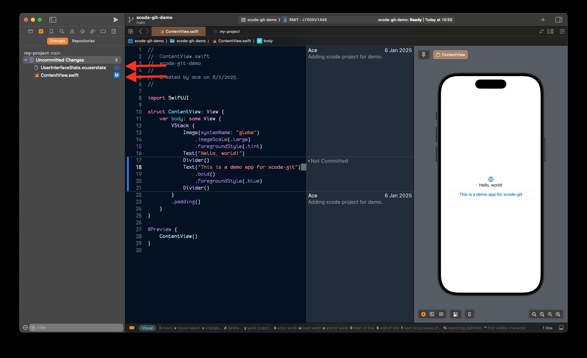

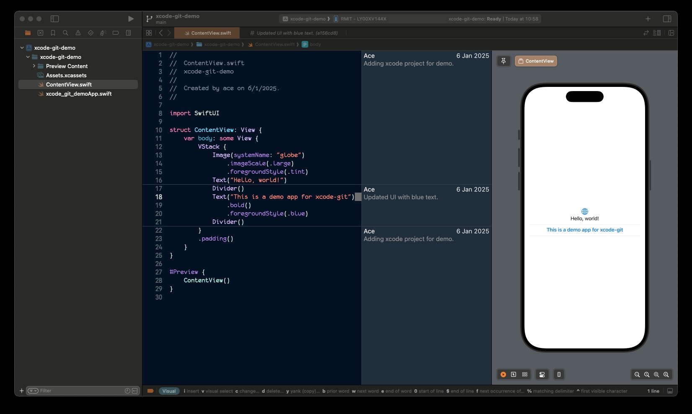

# Git Ignore File (.gitignore)

Some files should not be included into git repository. For example:

- `.DS_Store`
- `*.xcuserstate`

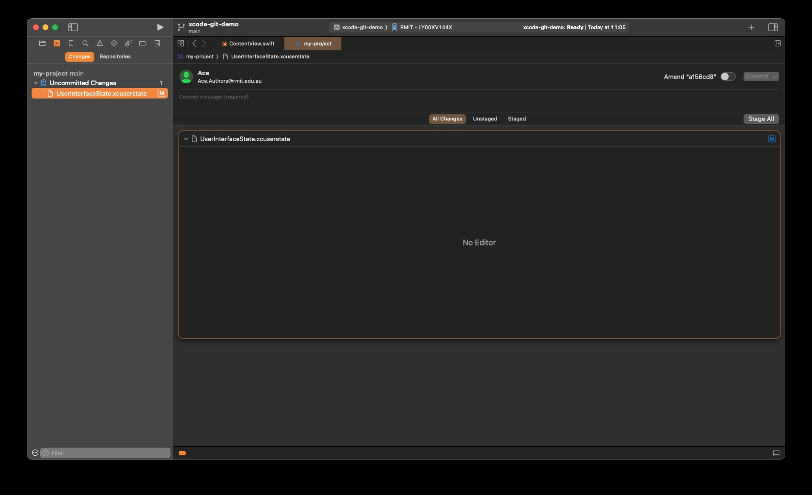

Solution: Add `.gitignore` file to project top-level directory.
This file contains 2 lines as shown below.

```
.DS_Store
*.xcuserstate
```

Optional - remove ignore files which have already been added to git.

```
$ git rm --cached path/to/.DS_Store
$ git rm --cached *.xcuserstate
```

Now add this new `.gitignore` file to your git repository.

```
$ git add .gitignore
$ git commit -m "Added git ignore file"
```

Now, notice when changing Xcode editor's configuration, Xcode stops reporting these changes as git changes.
