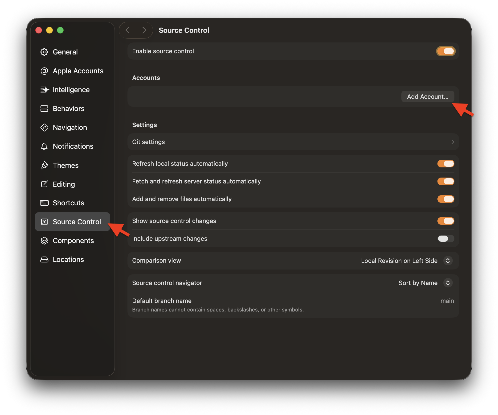
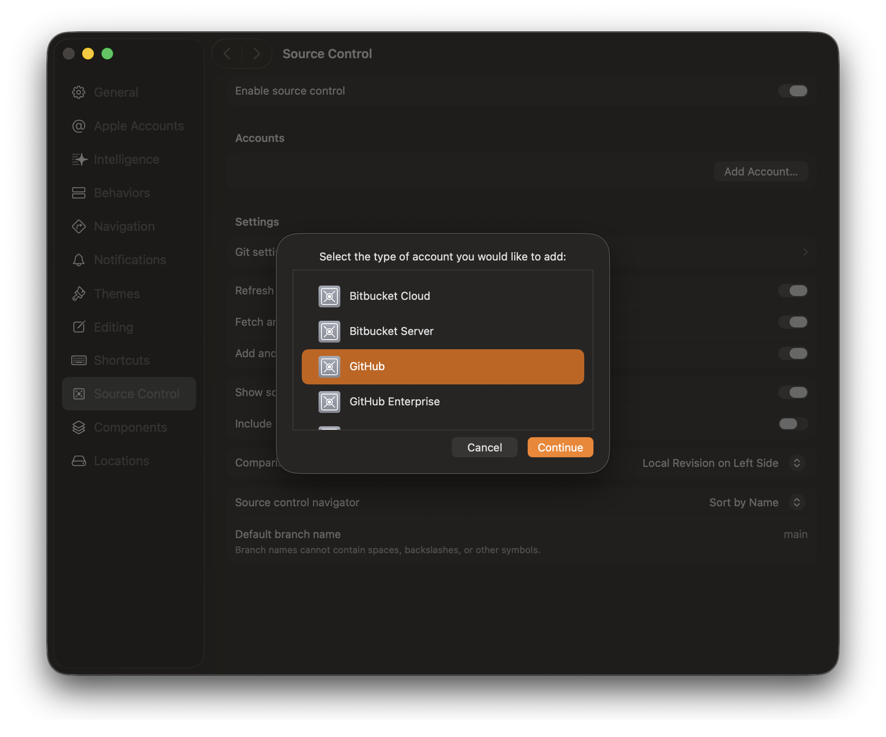
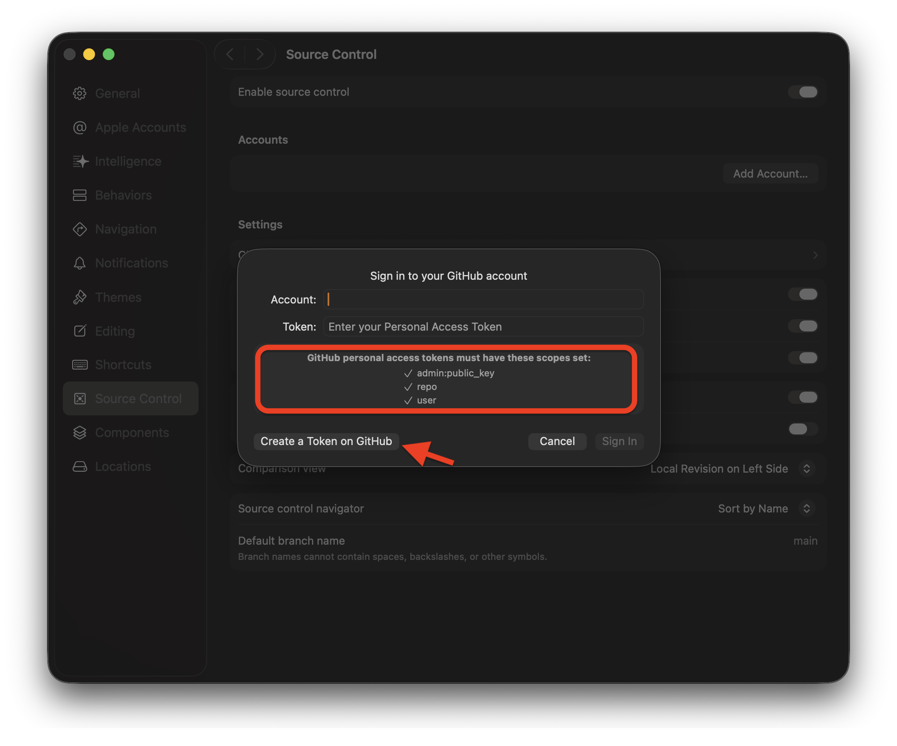
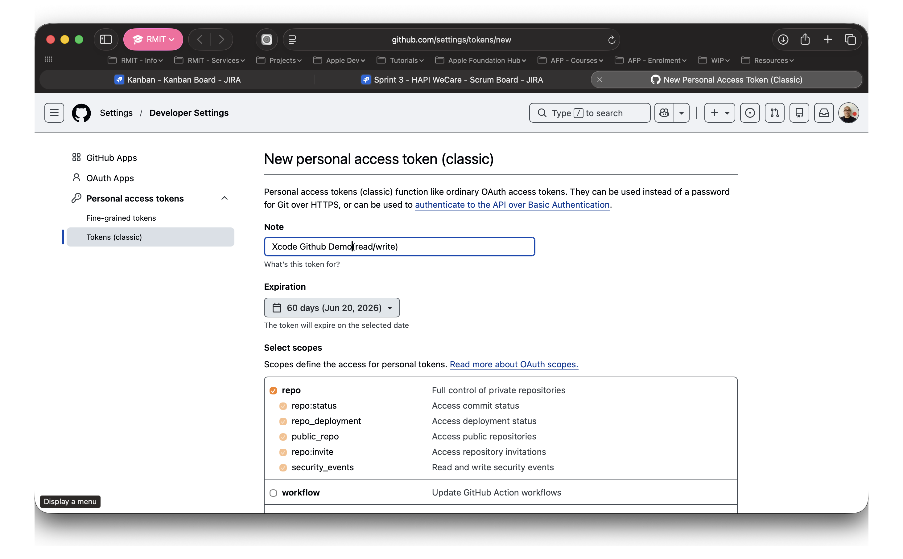
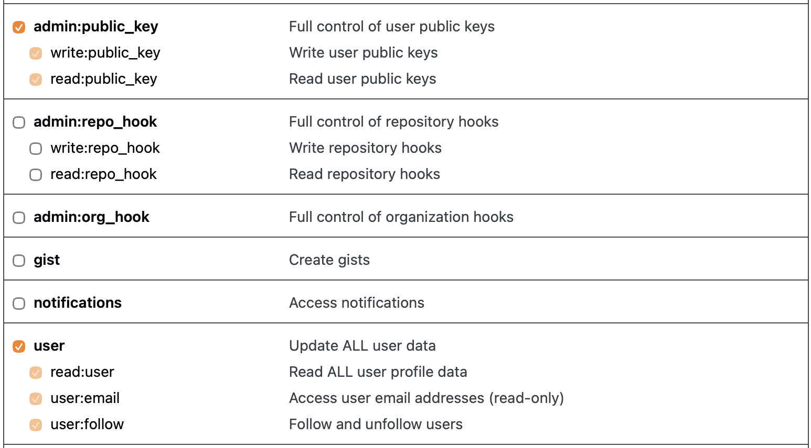
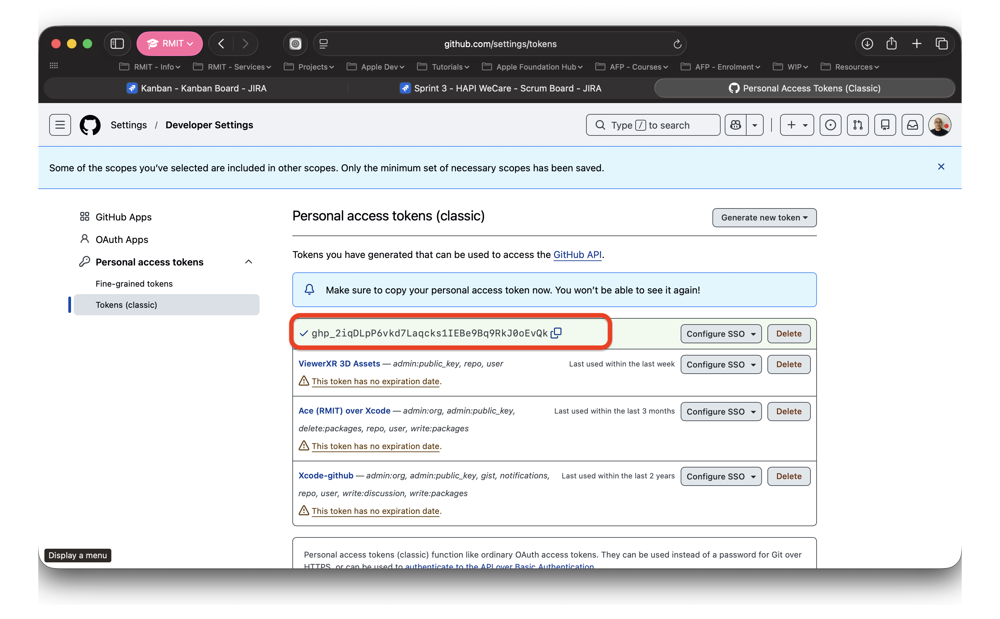
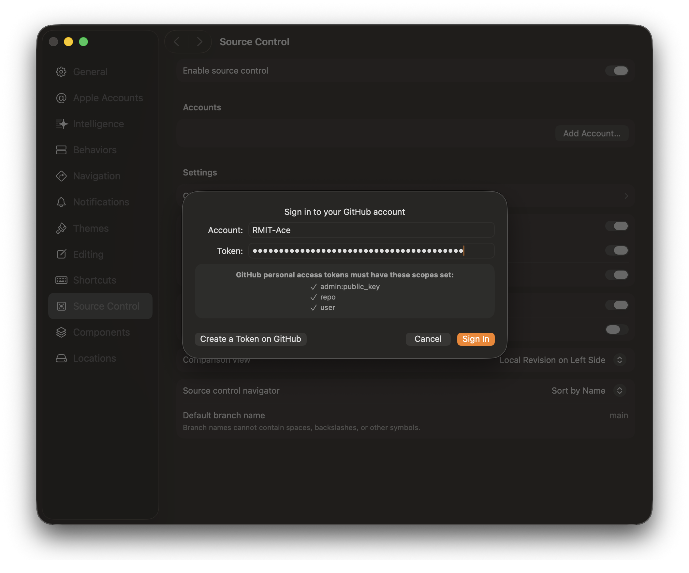
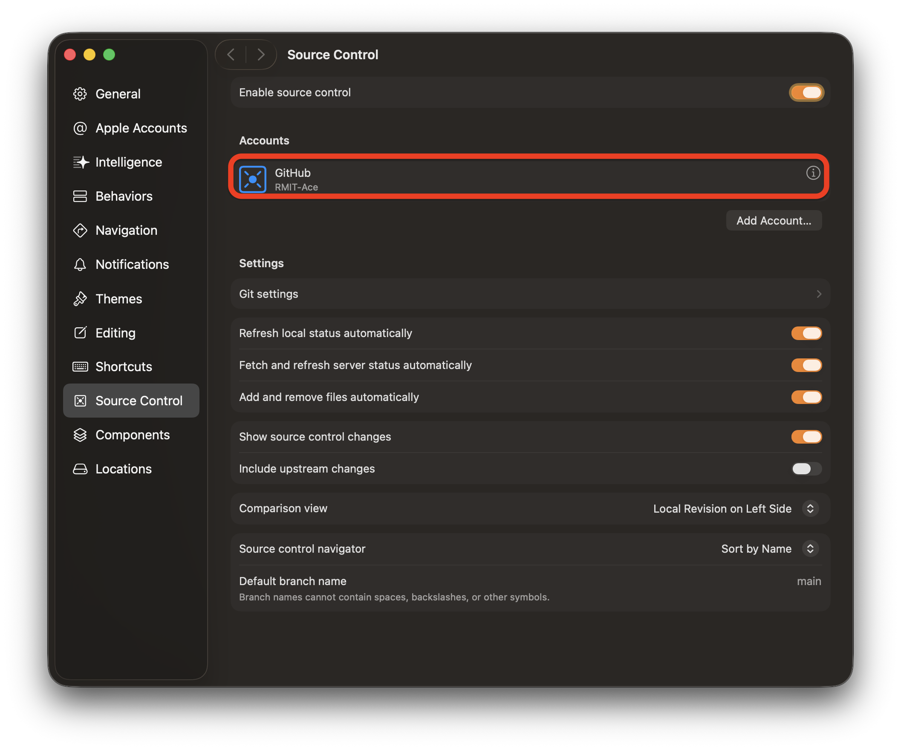

# Xcode and Github

Xcode with GitHub integration is a powerful combination for developers. It allows seamless collaboration, version control, and code sharing. With GitHub, you can easily manage your projects, collaborate with team members, and track changes in real-time. This integration enhances productivity, ensures code quality, and facilitates efficient project management. It's a must-have for modern software development.

In Xcode, go to Xcode → Settings from the menu bar, then select Source Control from the left sidebar. Make sure Enable source control is toggled on at the top. Under the Accounts section, click the Add Account… button to link your GitHub account.

A dialog appears asking you to select the type of account to add. Select GitHub from the list (it will highlight in orange), then click Continue.

A sign-in dialog appears. Note the message indicating that your personal access token must have the admin:public_key, repo, and user scopes enabled. Click Create a Token on GitHub to open GitHub in your browser and generate a token with the correct permissions.

GitHub opens in your browser to the New personal access token (classic) page. In the Note field, give your token a descriptive name (e.g. "Xcode Github Demo"). Set an Expiration period, then under Select scopes, check repo to grant full control of your repositories. Scroll down to enable the remaining required scopes.

Scroll down the scopes list and also check admin:public_key and user. These three scopes — repo, admin:public_key, and user — are all required for Xcode to connect to GitHub successfully.

GitHub generates your token and displays it once on the Personal Access Tokens page. Copy the token now using the copy icon — **you will not be able to see it again after leaving this page**.

Return to Xcode. Enter your GitHub username in the Account field, then paste the token you just copied into the Token field. Click Sign In.

Your GitHub account now appears under Accounts in the Source Control settings, showing your username below the GitHub icon. Xcode is now connected to GitHub and ready to use.